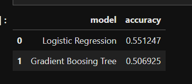
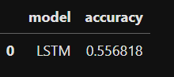
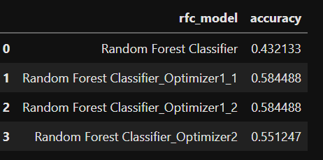
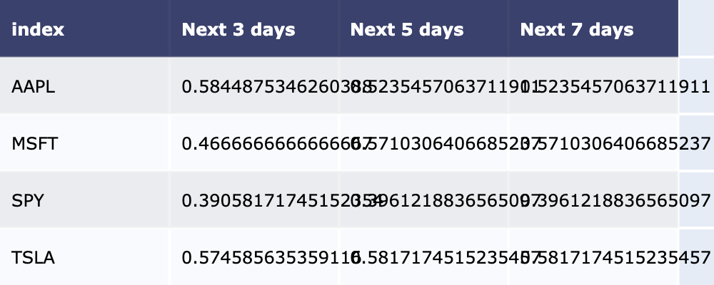

# PROJECT 2: APPLICATION OF MACHINE LEARNING IN PREDICTING STOCK DIRECTION
 

#### Team members: Amandeep Kaur, Hanna Ho, Nedal M., Nimai Desai, Ronald 

## Project Theme

Which machine learning model rendered the best results for determining stock direction?  

## Research Question

Predicting the direction of the stock has been always a strong interest of every trader because once we anticipate a trend we can make a profit via "buy low and sell high". However it's not an easy task. Stock market is subject to quick changes, random fluctuation, non linear, and non symentric mainly because participants are irrational, emotional, and implusive in their trading behavior . However complex the market is, there is a belief that given mass trading behaviors repetitive patterns exist, which is a foundation of technical analysis.

By using unsupervised machine learning models with the inputs as various of technical analysis indicators, we examine: 

1. Which was the best algo. to deterime stock direction?  
2. Which is the best model?
3. which time frame and and industry the model show the best result by testing various of prediction time frame and stocks of different industries?  

## Steps

## Implementation

### 1. Get data

We use yFinance for daily trading data  

### 2. Clean, prepare and manipulate data

We use Pandas, FinTA - Special note on time series can not use split

### 3. Train Models

We choose to run the supervised machine learning models for classification as follows:

1. Logistic Regression
2. Gradient Boosting Tree 
3. Support Vector Machines
4. LSTM using PCA
5. Random Forest Classifer
(please refer to folder file named "Supervised ML Models")

### 4. Testing Data and Result

4.1. Logistic Regression and Gradient boosting Classifier 

---
4.2 Support Vector Machine

Key lesson learnt

---

4.3 LSTM using PCA

ROC for testing data

---

4.5 Random Forest Classifer

---

### 5. Improve - Choose Random Forest Classifier Model

Method 1. Hyper Tunning using Gridsearch....

Method 2. Improve Data quality

### 6. Deploying best model

We have used the best model with the best result of accuracy and deploy for 4 stocks include AAPL, MIC.., SPY, TSLA

## Findings and Lessons

### Findings
*
*
*

### Lessons

*
*

***
New library used: GridSearchh.. [Ronald]

 

