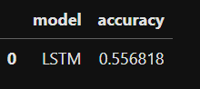
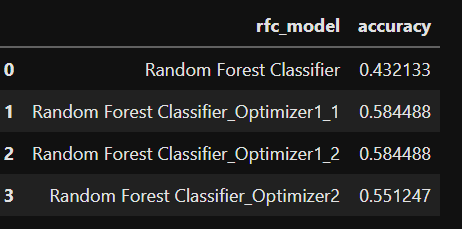
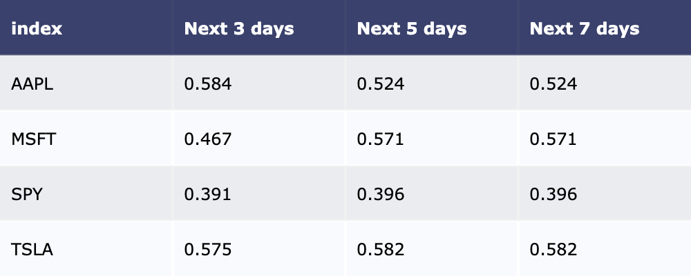

# PROJECT 2: APPLICATION OF MACHINE LEARNING IN PREDICTING STOCK DIRECTION
 

#### Team members  

Amandeep Kaur, Hanna Ho, Nedal Malkawe, Nimai Desai, Ronald  

## Project Theme  

Which machine learning model rendered the best results for determining stock direction?  

## Research Question

Predicting the direction of the stock has been always a strong interest of every trader because once we anticipate a trend we can make a profit via "buy low and sell high". However it's not an easy task. Stock market is subject to quick changes, random fluctuation, non linear, and non non-symmetric distribution mainly because participants are irrational, emotional, and implusive in their trading behavior . However complex the market is, there is a belief that given mass trading behaviors repetitive patterns exist, which is a foundation of technical analysis.

By using supervised machine learning models with the inputs as various of technical analysis indicators, we examine: 

1. What are algo. models we could use to determine stock trend?  
2. Which is the best model?
3. Which time frame and ticker the model show the best result by testing various of prediction time frame and stocks of different stocks?  

## Setup

Steps

Tested tickers : AAPL, MSFT, SPY, TSLA  
Time Frame: 3 days, 5 days, 7 days

## Implementation

### 1. Get data

We used yFinance for daily trading data.  

### 2. Clean, prepare and manipulate data

We used Pandas and FinTA library to calculate the technical indicators.

### 3. Train Models

We chose to run the supervised machine learning models for classification as follows:

1. Logistic Regression
2. Gradient Boosting Tree 
3. Support Vector Machines
4. LSTM using PCA
5. Random Forest Classifer

For time series data, we split train and test by len function to avoid data leakage.
(please refer to folder file named "Supervised ML Models")

### 4. Testing Data and Result

4.1. [Logistic Regression and Gradient boosting Classifier](https://github.com/Nimai95/Project-2-Machine-Learning/blob/main/Supervised%20ML%20Models/Logistic%20and%20GBT.ipynb)

---
4.2 [Support Vector Machine](https://github.com/Nimai95/Project-2-Machine-Learning/blob/main/resource/Aman/SVM.ipynb)

Despite high classification accuracy of support vector machines (SVM), normal SVM is not suitable for classification of large data sets, because the training complexity of SVM is very high.

---

4.3 [LSTM using PCA](https://github.com/Nimai95/Project-2-Machine-Learning/blob/main/Supervised%20ML%20Models/LSTM.ipynb)  

### Findings and Lessons  
* As the model  takes longer to train and requires more memory to train, so it's recommended  not to Use a big number of features , so it's better to reduce the number of features to be not more than 20 columns in my case
* Scaling the data using ` minmax scaler `  requires the data to be in 2D  array shape,  so you might need to reshape the data before scale it .
* Scaling the data using ` minmax scaler `  should be done for both X&Y
* Using  ` PCA ` is helpful to observe the trends , jumps ,clusters and outliers and should be done after scaling the data , otherwise it will be complaining about the  X array shape
* Using the ` dropout fraction `  has a significant affects in building the model as it is a techniques used for reducing the  `overfitting `
* Using  ` binary_crossentropy `  as a loss function when compiling the model
* Using the ` early stop `  function was helpful to reduce the training time

ROC for testing data

---

4.4 [Random Forest Classifer](https://github.com/Nimai95/Project-2-Machine-Learning/blob/main/Supervised%20ML%20Models/RFC.ipynb)

---

### 5. Improve - Random Forest Classifier Model

Method 1. Hyperparameter Tuning by GridsearchCV and BayesSearchCV  

Seeking a higher degree of accuracy GridSeachCV and BayesianSearchCV were used for hyperparameter optimization. Plots in sction 4.4 illlustrate the model results converge as accuracy increases. Using hyperparameter tuning achived accuracy improvements of .44 up to .58.  

Method 2. Improve Data Quality

Continous indicator iteration and choosing the best features that matter, the model accuracy scores rose from 0.43 to 0.55 

### 6. Deploying best model

Having the 'best' results among the models trained and tested Random Forest Classifier model showing the best accuracy results, was deployed targeting 4 stocks: AAPL, MSFT, SPY, TSLA - 3, 5 and 7 day time frames.

[Deployment and production results](https://github.com/Nimai95/Project-2-Machine-Learning/tree/main/Results ) for AAPL, MSFT, SPY and TSLA. 

Please refer to notebooks named [final_model_production](https://github.com/Nimai95/Project-2-Machine-Learning/blob/main/final_model_production.ipynb) and [Result](https://github.com/Nimai95/Project-2-Machine-Learning/blob/main/Result.ipynb) for more details.

## Findings and Lessons

### Findings

* Our best model is the Random Forest Classifier using GridSearchCV as a hyperparameter tunning tool
* Though it is the best among all the models we have tested, it shows a modest result with around 0.5 accuracy
* We aimed at optimizing the model to achieve higher precision and recall rate for an uptrend, and the model shows the good results to predict APPL in 3 days and TESLA in 5 days
* The results of the model are different for different stocks and time frames

### Lessons

* We have experienced both overfitting and underfitting and understood that we need to find out the sweet spot for a good fit
* Imperfections when data grows when we split 70/30 and 80/20 the result significantly changes
* It's hard to find out one model fit all, and the challenge is to keep the accuracy score stable

##  New library  

GridSearchCV  
BayesianSeachCV  

### Findings  

* While GridSearchCV: 1m 36s. was important to achieve higher accuracy scores BayesianSearchCV: 1m 24s. was tested to gain insight.
* The 2 cross validations for Random Forest hyperparameter tuning returened matching results: criterion = 'gini', max_depth = 2, n_estimators = 10.
* Notably the greatest impact GridSearchCV v. BayesianSearchCV was processing time and resource usage. Suggestion to use n_jobs=-1, to gain fuller usage of system hardware by using all processors, returned significant time savings: GridSearchCV: 14s, BayesianSeachCV: 1m 9s.
* Futher study required to deploy [Hyperparameter optimization across multiple models in scikit-learn](https://www.davidsbatista.net/blog/2018/02/23/model_optimization).
